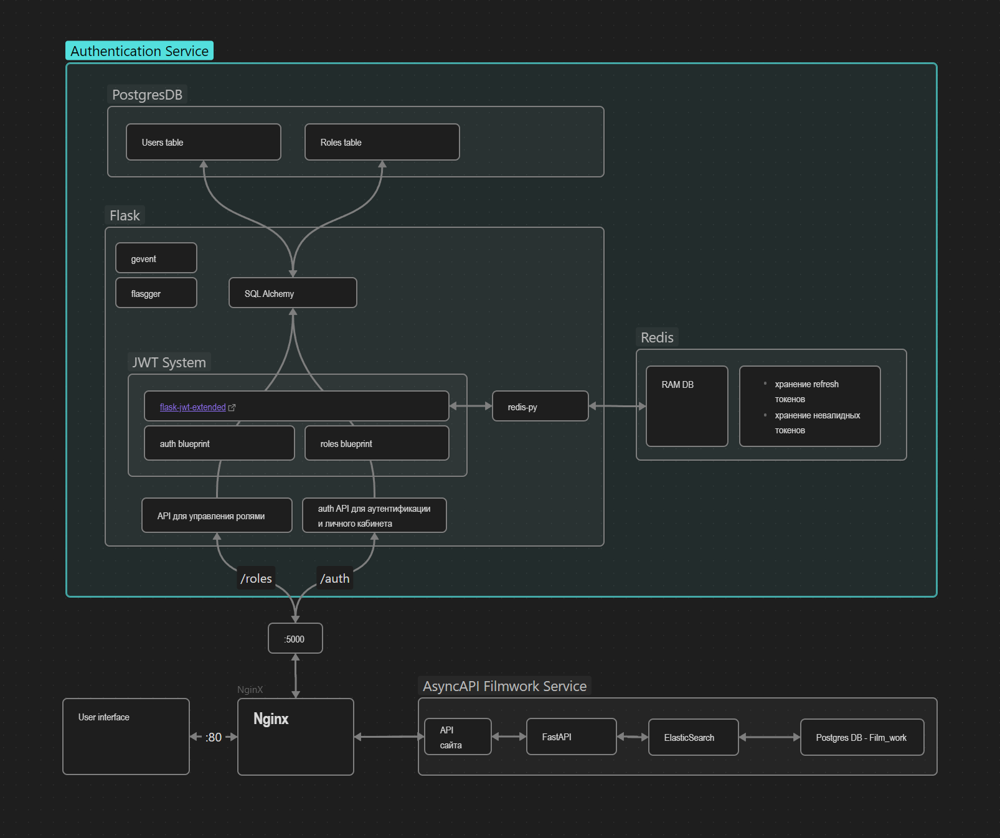

В данном репозитории реализован сервис авторизации с системой ролей, написанный на Flask 
с использованием gevent. Сервис является частью проекта онлайн-кинотеатра, описание которого 
размещено здесь:
https://github.com/DmitryRybko/Async_API_sprint_1/blob/main/fastapi-solution/README.md

Сервис использует аутентификацию с помощью JWT токенов (используется модуль jwt-extended).
Redis используется для хранения refresh токенов и невалидных токенов.
Информация о пользователях и ролях хранится в Postgres.

Также, реализована аутентификация и авторизация с помощью социальных сервисов: пользователи могут осуществлять вход
с учетной записью google. В качестве схемы взаимодействия используется Web-server flow. Необходимо зарегистрировать 
приложение-клиент https://console.cloud.google.com/apis/credentials, получить client_id и client_secret и 
указать их в .env. В результате процесса Provider выдает JWT токен вместе с email и name пользователя. Если 
пользователя нет в базе данных, он создается. После этого пользователю выдается внутренний access token и refresh token. 

При обращении к сервису онлайн-кинотеатра проверка токенов осуществляется на уровне nginx. 
Также, в nginx настроено ограничение количества запросов к серверу.

Распределённая трассировка запросов осуществляется с помощью Jaeger, который поднимается отдельным контейнером в
docker-compose.

Общая схема сервиса авторизации:

### API для сайта и личного кабинета

- регистрация пользователя;
- регистрация пользователя с помощью учетной записи google;
- вход пользователя в аккаунт (обмен логина и пароля на пару токенов: JWT-access токен и refresh токен); 
- обновление access-токена;
- выход пользователя из аккаунта;
- изменение логина или пароля.

##API

Документация Auth API и Roles API на базе flasgger формируется здесь:
http://127.0.0.1:5000/apidocs/

### API для управления доступами

- CRUD для управления ролями:
  - создание роли,
  - удаление роли,
  - изменение роли,
  - просмотр всех ролей.
- назначить пользователю роль;
- отобрать у пользователя роль;
- метод для проверки наличия прав у пользователя. 

### Запуск сервиса авторизации:
- docker-compose -f docker-compose.yml up -d --build
или
- docker-compose -f docker-compose-dev.yml up -d --build (development вариант с тестами)

Задачи, выполненные в рамках спринта 7:
https://github.com/users/DmitryRybko/projects/6